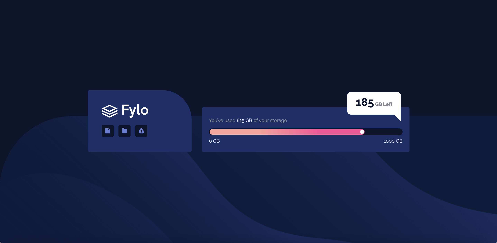
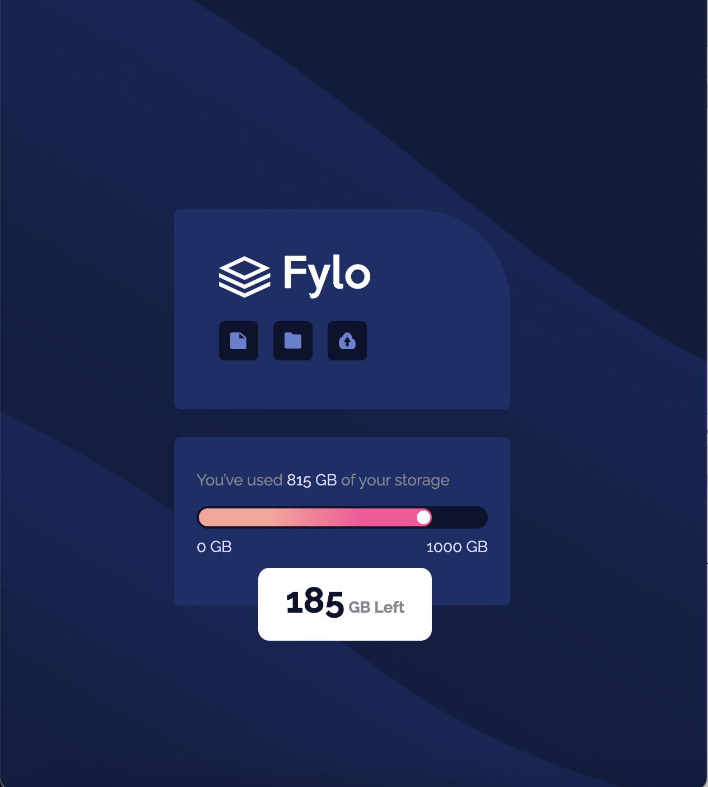

# Frontend Mentor - NFT preview card component solution

This is a solution to the [Flyo data storage component challenge on Frontend Mentor](https://www.frontendmentor.io/challenges/fylo-data-storage-component-1dZPRbV5n).

### The challenge

Users should be able to:

- View the optimal layout depending on their device's screen size

### Links

- Live Site URL: [https://jacobf-business-card-preview.netlify.app/](https://jacobf-business-card-preview.netlify.app/)
- Solution submission URL: [https://www.frontendmentor.io/solutions/html-css-TzZZBAj4ez](https://www.frontendmentor.io/solutions/html-css-TzZZBAj4ez)

### Screenshot

### Built with

- HTML
- CSS

### Author

- Linkedin - [Jacob Fashanu](https://www.linkedin.com/in/jacob-fashanu/)
- Frontend Mentor - [@jacobfashanu](https://www.frontendmentor.io/profile/jacobfashanu)
